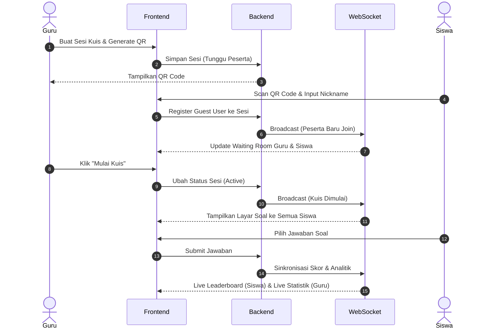
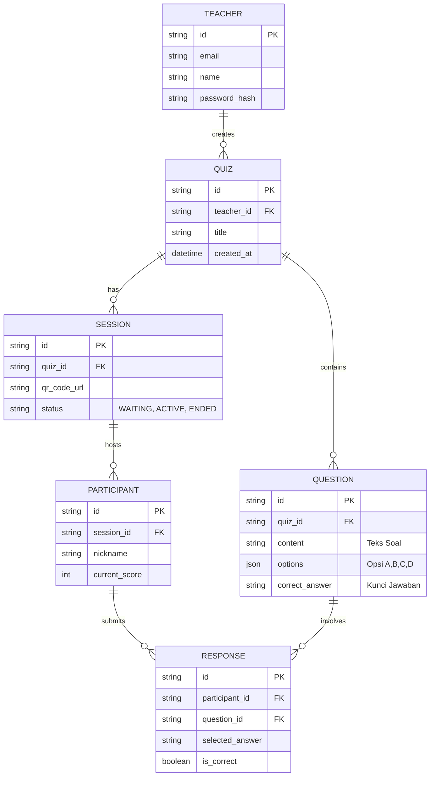

# PRD — Project Requirements Document

## 1. Overview
Aplikasi ini adalah platform kuis interaktif berbasis web (mirip Quizizz) yang didesain khusus melalui pendekatan gamifikasi untuk siswa SD, SMP, dan SMA. Masalah utama yang ingin dipecahkan adalah suasana kelas yang sering kali membosankan sehingga guru membutuhkan alat untuk membuat pembelajaran menjadi lebih aktif, seru layaknya bermain *game*, dan kompetitif dengan cara yang sehat. 

Dengan sistem tanpa akun (cukup *scan* QR Code dan masukkan nama panggilan) serta fitur real-time (skor langsung, papan peringkat, dan analitik jawaban), aplikasi ini mengedepankan kecepatan akses bagi siswa dan kemudahan kontrol bagi guru.

Dari sisi pengelolaan, aplikasi membedakan dua peran utama: Admin dan Guru. Admin memiliki kewenangan penuh untuk menambahkan akun guru baru ke dalam sistem, sementara Guru bertanggung jawab membuat, mengelola, dan menjalankan kuis.

## 2. Requirements
- **Fokus Pengguna Kuis:** Tampilan UI/UX harus sangat interaktif, berwarna, dan menarik bagi demografi anak sekolah.
- **Tipe Soal:** Sistem hanya mendukung soal Pilihan Ganda (*Multiple Choice*).
- **Akses Cepat (Tanpa Sandi):** Autentikasi siswa murni berbasis sesi menggunakan *scan* QR Code dan input nama/nickname.
- **Kemampuan Real-time:** Memerlukan pembaruan data secara langsung tanpa perlu *refresh* halaman (untuk papan peringkat, ruang tunggu, dan analitik jawaban guru).
- **Desain Responsif:** Harus berfungsi sempurna di perangkat portabel/sekolah (seperti _smartphone_ dan tablet siswa) maupun proyektor/laptop (untuk *dashboard* guru).

## 3. Core Features
Fitur-fitur utama dikembangkan berdasarkan tahapan rilis (Roadmap) berikut:

**Fase 0: Manajemen Pengguna & Login**
- **Login Admin & Guru:** Sistem autentikasi terpisah untuk Admin dan Guru. Admin memiliki akses penuh ke panel manajemen pengguna, sedangkan Guru memiliki akses ke panel pembuatan dan pengelolaan kuis.
- **Manajemen Akun Guru (Admin):** Admin dapat membuat akun guru baru, melihat daftar seluruh guru terdaftar, dan menghapus akun guru yang sudah tidak aktif. Fitur ini mencakup manajemen kredensial (email dan password) serta validasi akun.
- **Panel Kontrol:** Setelah login, masing-masing peran diarahkan ke dashboard khusus yang sesuai dengan tugasnya: Admin untuk manajemen pengguna; Guru untuk persiapan dan pelaksanaan kuis.

**Fase 1: Kuis Interaktif**
- **Pembuatan Kuis oleh Guru:**
  - Guru membuat paket kuis baru dengan mengisi judul dan deskripsi.
  - Guru menuliskan soal-soal pilihan ganda, memasukkan pilihan jawaban (A, B, C, D), serta menentukan kunci jawaban yang benar. Editor soal mendukung penulisan sintaks LaTeX untuk ekspresi matematika, rumus fisika, dan simbol khusus.
  - Guru melakukan 'Publish' kuis. Setelah dipublikasi, sistem secara otomatis meng-generate QR Code dan link akses kuis yang dapat dibagikan kepada siswa.
- **Tampilan Soal & Jawaban:** Antarmuka interaktif yang menampilkan pertanyaan dan pilihan ganda.
- **Skor Langsung:** Sistem penambahan skor yang otomatis dan seketika saat jawaban benar.
- **Peringkat (Leaderboard):** Papan klasemen real-time yang bisa dilihat siswa untuk membandingkan posisi mereka.
- **Umpan Balik Jawaban:** Elemen audiovisual (suara dan animasi) setelah siswa memilih jawaban.
- **Efek Gamifikasi:** Suasana *game* kuis kompetitif demi menjaga ketertarikan (retensi) perhatian siswa.
- **Apresiasi Akhir Sesi:** Setelah kuis berakhir, sistem secara otomatis menampilkan pesan apresiasi personal kepada tiap siswa berdasarkan capaian skor akhir. Siswa dengan skor tinggi menerima pesan motivasi seperti "Selamat! Kamu Hebat!" dan siswa dengan skor rendah mendapatkan pesan penyemangat seperti "Tetap Semangat! Coba Lagi Ya!" untuk tetap membangun kepercayaan diri.
- **Dukungan LaTeX untuk Soal & Jawaban:** Guru dapat menuliskan konten soal dan opsi jawaban menggunakan sintaks LaTeX, memungkinkan tampilan persamaan matematika, rumus fisika, dan simbol khusus secara profesional di antarmuka kuis siswa.

**Fase 2: Ruang Tunggu dan Kontrol Guru**
- **Ruang Tunggu (Daftar Peserta & Status):** Layar transit (*lobby*) bagi siswa yang menunggu kuis dimulai, menampilkan indikator *waiting* dan daftar nama peserta.
- **Notifikasi Mulai:** Transisi otomatis dari ruang tunggu ke layar soal kuis sesaat setelah kuis diklik "mulai" oleh guru.
- **Kontrol Guru (Dashboard):** 
  - Panel pemantauan ruang tunggu dan jumlah partisipan.
  - Opsi mengeksekusi "Mulai Kuis" untuk seluruh peserta secara serentak.
  - Opsi "Akhiri Kuis" secara manual.
  - Pemantauan keseluruhan status sesi kuis yang berjalan.

**Fase 3: Statistik Jawaban Real-time**
- **Diagram Per Soal:** Visulisasi grafik/diagram (batang atau lingkaran) untuk distribusi benar/salah tiap pertanyaan yang sedang dijawab sisa.
- **Tabel Hasil Detail:** Tabel breakdown yang memuat metrik capaian benar/salah setiap soalnya.
- **Pembaruan Otomatis:** Sistem dasbor *background event* untuk merekapitulasi jawaban hidup (live) tanpa *refresh*.
- **Download Laporan Hasil Kuis:** Guru dapat mengunduh laporan lengkap hasil kuis dalam format CSV atau PDF. Laporan mencakup skor akhir setiap siswa, rincian jawaban benar/salah per soal, persentase ketuntasan kelas, serta statistik ringkasan. Fitur ini membantu dokumentasi dan evaluasi pembelajaran di luar sistem.

**Fase 4: Login via QR Code**
- **Pindai QR Code:** Gateway utama untuk mengikuti kuis dengan menggunakan kamera perangkat siswa.
- **Input Nama:** Form statis untuk memasukkan nama panggilan (*Nickname*).
- **Konfirmasi Masuk:** Button "Join" yang memindahkan akses dari layar login *guest* ke *waiting room*.

## 4. User Flow
1. **Persiapan Guru (Fase 2 & 4):** Guru *login* ke dalam sistem, memilih kuis pilihan ganda yang ada, dan merilis sesi (*host quiz*). Sistem menghasilkan QR Code.
2. **Akses Siswa (Fase 4):** Siswa memindai QR Code tersebut dengan ponsel menggunakan aplikasi pemindai bawaan ponsel, diarahkan ke *link* sesi kuis, mengetik "Nama Panggilan", dan klik 'Bergabung'.
3. **Ruang Tunggu (Fase 2):** Siswa masuk ke laman ruang tunggu (*waiting room*). Di saat bersamaan, layar guru (*dashboard*) secara seketika memunculkan nama siswa tersebut.
4. **Kuis Berlangsung (Fase 1 & 3):** Guru menekan tombol 'Mulai Kuis'. Layar ponsel seluruh siswa berpindah ke pertanyaan pertama.
5. **Menjawab & Gamifikasi (Fase 1 & 3):** Siswa menjawab soal. Muncul animasi umpan balik (benar/salah) serta skor yang meroket (*Live Score*). Siswa memantau *Leaderboard* mereka.
6. **Analisis Terkini (Fase 2 & 3):** Selama kuis berlangsung, layar guru diperbarui otomatis secara real-time—menampilkan grafik persentase benar dan salah per soal saat murid mengirimkan satu per satu jawabannya.
7. **Selesai (Fase 2):** Setelah pertanyaan habis atau guru menekan 'Akhiri Kuis', hasil perolehan dikunci dan Leaderboard terakhir dimunculkan.

## 5. Architecture
Sistem harus menggunakan arsitektur *Client-Server* dengan tambahan komponen *WebSocket* (layanan integrasi real-time seperti Pusher atau Socket.io) untuk menangani status sesi, notifikasi mulai, sinkronisasi ruang tunggu, dan papan peringkat instan.

## 6. Database Schema
Kebutuhan penyimpanan data sederhana dan dioptimalkan untuk beban membaca (skor dan kuis) dalam satu sesi.

*Penjelasan Singkat Tabel:*
- **TEACHER (`users`)**: Menyimpan data login/akun guru.
- **QUIZ**: Mengelompokkan *set* kuis (mis: "Kuis Sejarah Majapahit").
- **QUESTION**: Menyimpan soal pilihan ganda spesifik dan kuncinya. Opsi dapat diubah menjadi array JSON.
- **SESSION**: *Instance* spesifik dari satu kuis yang sedang dimainkan di kelas. Menyimpan URL QR-nya.
- **PARTICIPANT**: Peserta tanpa akun (Siswa). Mengikat *nickname* siswa dengan `session_id` tempat mereka berada beserta total skor mereka *(Live Score)*.
- **RESPONSE**: Menyimpan log setiap jawaban masuk. Ini kunci untuk menghitung *Statistik Jawaban Real-time* tiap-tiap soal (Fase 3).

## 7. Tech Stack
Berikut adalah rekomendasi tumpukan teknologi modern untuk mengembangkan platform real-time, responsif, dan andal:

- **Frontend:** Next.js (React Framework untuk struktur yang SEO-friendly jika diperlukan namun sangat optimal untuk performa *rendering* cepat).
- **Styling & UI:** Tailwind CSS dan shadcn/ui (untuk merakit UI dan elemen gamifikasi secara cepat dengan komponen estetik).
- **Backend/API:** Terpadu di dalam Next.js (Server Actions / Route Handlers).
- **Real-time Engine:** Pusher (Sangat dianjurkan ketimbang WebSocket *native* atau Polling untuk integrasi *serverless API* Next.js agar *Live Score* dan *Waiting Area* mulus).
- **Database:** SQLite (Cocok untuk skala MVP / starter app) dengan kemungkinan diubah ke PostgreSQL (seperti Supabase) kelak untuk skalabilitas *Dashboard Guru*.
- **ORM:** Drizzle ORM (Performa sangat cepat dan manajemen skema secara _type-safe_).
- **Authentication:** Better Auth (untuk autentikasi Guru yang ringan, aman, dan mudah di-setup). *Guest session* siswa dapat ditangani melalui Token/Cookie sementara.